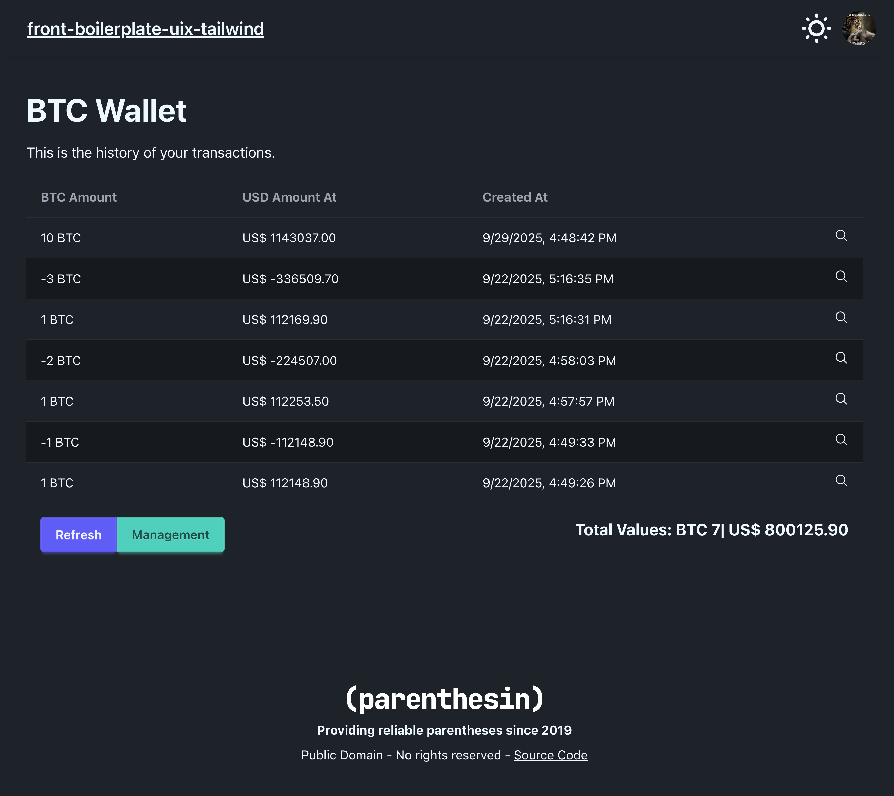
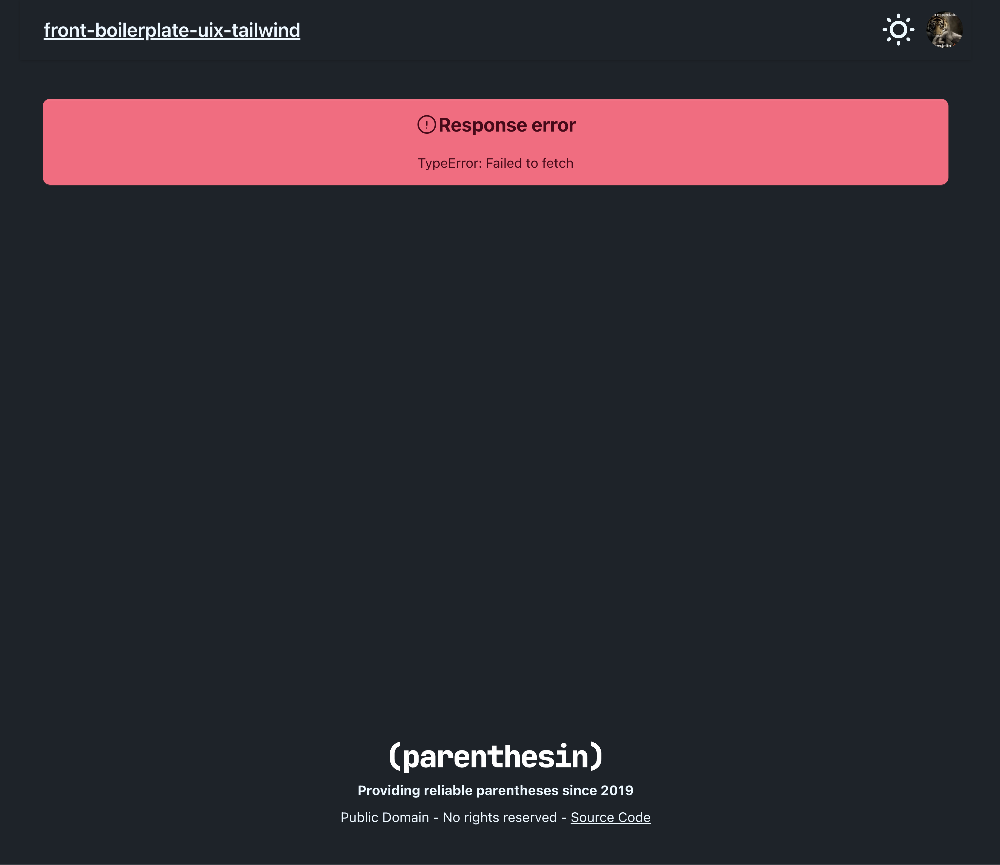
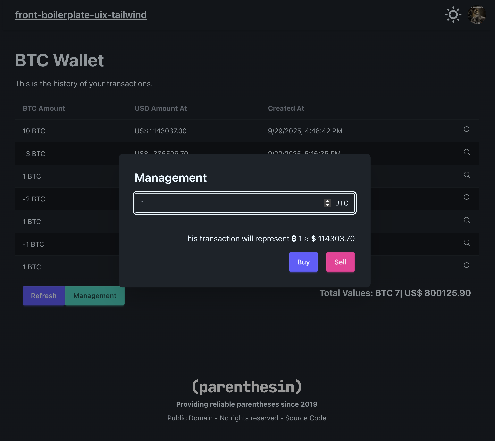

# front-boilerplate-uix-tailwind 

Minimal uix and tailwind example, with shadow-cljs (and daisyUI for css components).

## How to use
```bash
# Install dependencies
npm i

# Start application with shadow (app + portfolio + tests)
npm start

# Run CI tests
npm test

# Release the final version
npm run release
```

## Screenshots

### Home


### Home with error

> This error will happen when a backend server wasn't found.

### Management form


### Management form with a value


### Management form with a validation error

> This error will happen when we try to sell more than we own.

## Structure
```
.
├── dev
│   └── portfolio
│       ├── scenes
│       │   ├── shell.cljs
│       │   └── wallet.cljs
│       └── core.cljs
├── resources
│   └── public
│       ├── assets
│       │   └── parenthesin.svg
│       ├── css
│       │   └── index.css
│       ├── favicon.ico
│       └── index.html
├── src
│   └── parenthesin
│       └── front_boilerplate
│           ├── infra
│           │   ├── http
│           │   │   └── component.cljs
│           │   ├── system
│           │   │   └── state.cljs
│           │   ├── http.cljs
│           │   └── preferences.cljs
│           ├── panels
│           │   ├── shell
│           │   │   ├── components.cljs
│           │   │   └── view.cljs
│           │   └── wallet
│           │       ├── adapters.cljs
│           │       ├── components.cljs
│           │       ├── state.cljs
│           │       └── view.cljs
│           ├── config.cljs
│           └── core.cljs
├── test
│   └── parenthesin
│       └── front_boilerplate
│           └── test
│               ├── aux
│               │   ├── fixtures
│               │   │   └── wallet.cljs
│               │   ├── helpers.cljs
│               │   ├── init.cljs
│               │   └── testing_library.cljs
│               └── panels
│                   └── wallet
│                       ├── adapters_test.cljs
│                       ├── components_test.cljs
│                       └── view_test.cljs
├── deps.edn
├── karma.conf.js
├── LICENSE
├── package-lock.json
├── package.json
├── README.md
└── shadow-cljs.edn
```

### Conventions
This project follows some conventions to keep the codebase clean and maintainable:
- **Config**: defined mainly at `src/parenthesin/front_boilerplate/config.cljs` we can check for our global configuration, having all host and port for our running instance and for our backend instance, as you can define more `env variables` using `goog-define`.
- **Global State**: we use a global state management system to handle application state. By default, Clojure projects have a concept of components, which is entirely different from what we call components here. The goal is to keep this concept simple to avoid problems, calling it as a `system state`, which you can find defined in `src/parenthesin/front_boilerplate/infra/system/state.cljs`.
- **Base structure**: the base structure follow a concept to treat panels as main directory structure. Every panel can be treated as a `screen` from some other React projects. Evey panel can have it own `components`, it own `state`, it own `adapters` and finally a `view`, which has the main defined UIx component to render, most of the time having all components and state managed internally.
- **Components**: by default we can have internal components from a specific panel but we can also have global components defined to deal with different scenarios (at this moment we don't have any of them but you can create inside a directory on `src/parenthesin/front_boilerplate/components/`).
- **Using UIx**: as you probrably know (or not) UIx follows a similar syntax to [hiccup](https://github.com/weavejester/hiccup) when rendering a component. By default a convention to know when to use a simplified syntax to define classes (like `:.flex.bg-red` where the first `.` is for a simple `div`) have to be used only when it's the only thing to define for that component. So as an example below:
    ```cljs
    ($ :.flex.bg-red) ;; that's ok

    ($ :div.flex.bg-red) ;; that's fine

    ($ :div {:className "flex bg-red"}) ;; ok...

    ($ :button.btn.btn-ghost "some button") ;; that's ok

    ($ :button.btn.btn-ghost 
      {:onClick #(prn %)}
      "some button") ;; avoid that

    ;; instead
    ($ :button
      {:className "btn btn-ghost"
       :onClick #(prn %)}
      "some button")
    ```

### After running `npm start`
- App available at http://localhost:5000
- Portfolio available at http://localhost:5001
- Test ui available at http://localhost:5002

## Used software
- [shadow-cljs](https://github.com/thheller/shadow-cljs)
- [uix](https://github.com/pitch-io/uix)
- [tailwind](https://github.com/tailwindlabs/tailwindcss)
- [portfolio](https://github.com/cjohansen/portfolio)
